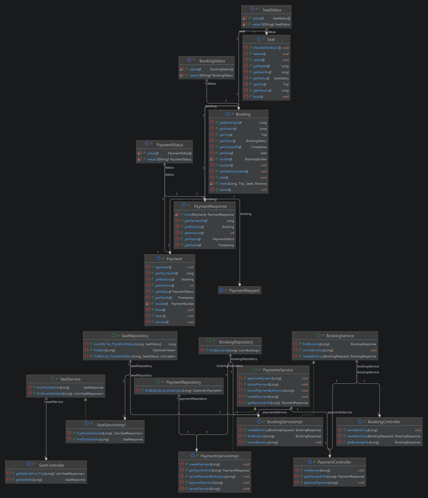
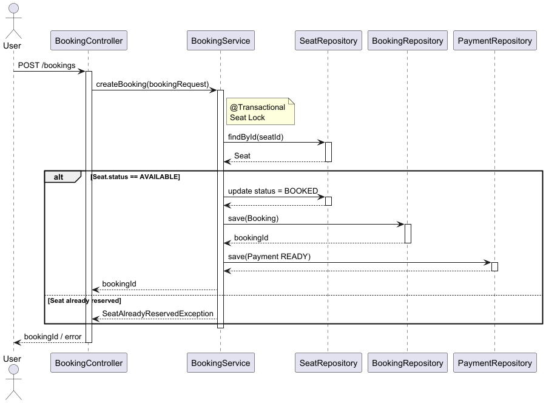
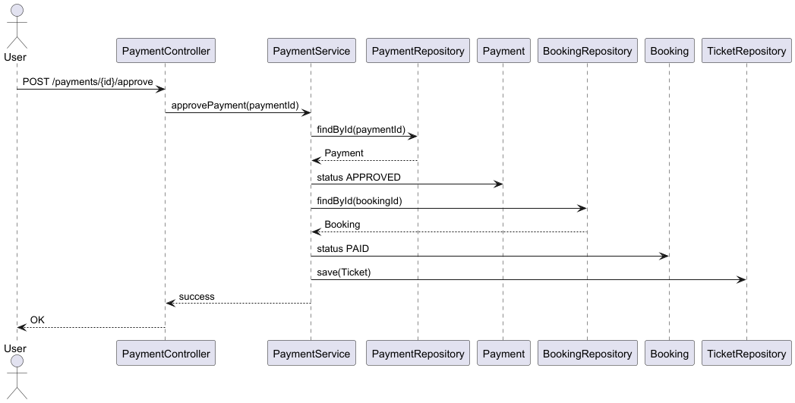
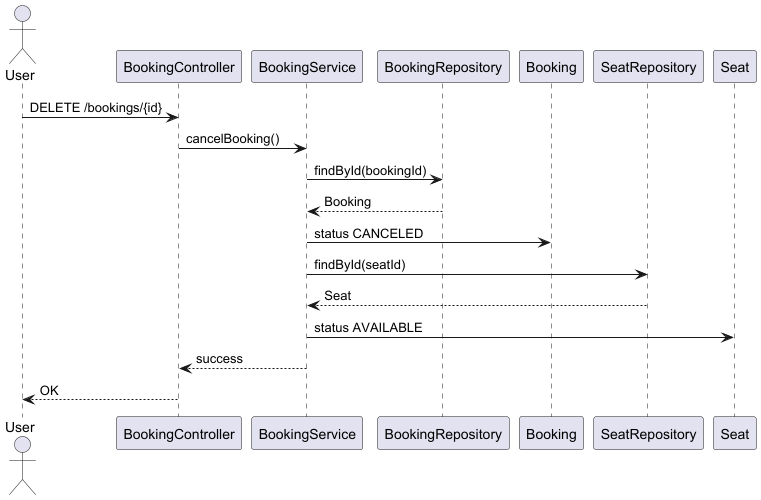

# 🚆 Train Ticket Reservation System

열차 여행 예약 시스템을 구현한 백엔드 프로젝트입니다.

사용자는 열차를 조회하고 좌석을 선택하여 예약을 생성하고, 결제를 완료하면 티켓을 발급받을 수 있습니다.

이 프로젝트는 **Spring Boot + JPA 기반으로 Domain Driven Design 스타일 구조를 적용하여**

예약 시스템에서 발생할 수 있는 **좌석 중복 예약 문제와 결제 상태 관리**를 고려하여 설계되었습니다.

---

# 📌 주요 기능

- 열차 조회
- 좌석 조회
- 좌석 예약
- 결제 생성
- 결제 승인
- 결제 취소
- 티켓 발급

---

# 🛠 Tech Stack

### Backend

- Java 17
- Spring Boot
- Spring Data JPA (Hibernate)

### Database

- MySQL

### Architecture

- DDD(Domain Driven Design Style Package Structure)
- Layered Architecture

### Tools

- Gradle
- Docker
- GitHub

---

# 🏗 System Architecture

```
Controller
   ↓
Service (Transaction Boundary)
   ↓
Domain Entity
   ↓
Repository
   ↓
Database
```

각 계층의 역할

**Controller**

- HTTP 요청 처리
- Request/Response DTO 변환

**Service**

- 비즈니스 로직 처리
- 트랜잭션 관리

**Domain Entity**

- 핵심 비즈니스 모델
- 상태 변경 로직 포함

**Repository**

- 데이터 접근 계층
- JPA 기반 데이터 조회

---

# 📊 Domain Model (Class Diagram)



주요 도메인은 다음과 같습니다.

```
Station
Trip
Seat
Booking
Payment
Ticket
```

### Domain Relationships

```
Trip
 └ Seat

Booking
 └ Ticket
```

설명

- **Trip** 은 여러 개의 **Seat** 를 가집니다.
- 사용자가 좌석을 예약하면 **Booking** 이 생성됩니다.
- 결제가 완료되면 **Ticket** 이 생성됩니다.
- **Payment** 는 예약에 대한 결제 상태를 관리합니다.

---

# 🗄 Database Design (ERD)

주요 테이블

- Station
- Trip
- Seat
- Booking
- Payment
- Ticket

---

# 🔄 Reservation Flow


### 예약 프로세스

1. 사용자가 열차를 검색합니다.
2. 사용자가 좌석을 선택합니다.
3. 예약 요청을 생성합니다.
4. 좌석 상태를 확인합니다.
5. 예약이 생성됩니다.
6. Payment 상태는 **READY** 로 생성됩니다.

---

# 💳 Payment Flow


### 결제 프로세스

1. 사용자가 결제를 요청합니다.
2. Payment 상태를 확인합니다.
3. 결제가 승인됩니다.
4. Payment 상태가 **APPROVED** 로 변경됩니다.
5. Booking 상태가 **PAID** 로 변경됩니다.
6. Ticket 이 생성됩니다.

---

# ❌ Payment Cancel Flow


### 결제 취소 프로세스

1. 사용자가 결제 취소 요청을 합니다.
2. Payment 상태를 확인합니다.
3. Payment 상태를 **CANCELD**로 변경합니다.
4. Booking 상태를 **CANCELD** 로 변경합니다.
5. 좌석 상태를 **AVAILABLE** 로 변경합니다.

---

# ⚠️ Concurrency Control (좌석 중복 예약 문제)

예약 시스템에서는 여러 사용자가 동시에 같은 좌석을 예약할 수 있는 문제가 발생할 수 있습니다.

예시 상황

```
User A → Seat 10 예약 시도
User B → Seat 10 예약 시도
```

두 요청이 동시에 처리되면 **중복 예약(Double Booking)** 이 발생할 수 있습니다.

### 해결 전략

### 1️⃣ Optimistic Lock

Seat Entity에 version 필드를 두어 동시 수정 충돌을 감지합니다.

```java
@Version
private Long version;
```

동시에 좌석 상태를 변경하면 **OptimisticLockException** 이 발생합니다.

---

### 2️⃣ Seat Status 기반 예약 제어

좌석 상태가 **AVAILABLE** 일 때만 예약이 가능합니다.

```
AVAILABLE → RESERVED
```

예시

```sql
update seat
set status = 'RESERVED'
where seat_id = ?
and status = 'AVAILABLE'
```

조건이 맞지 않으면 예약이 실패합니다.

---

# 🔄 Transaction Design

예약과 결제는 각각 **트랜잭션 단위로 관리됩니다.**

### 예약 생성

```
@Transactional
BookingService.createBooking()
```

처리 내용

- 좌석 상태 확인
- Booking 생성
- Payment 생성 (READY)

---

### 결제 승인

```
@Transactional
PaymentService.approvePayment()
```

처리 내용

- Payment 상태 변경
- Booking 상태 변경
- Ticket 생성